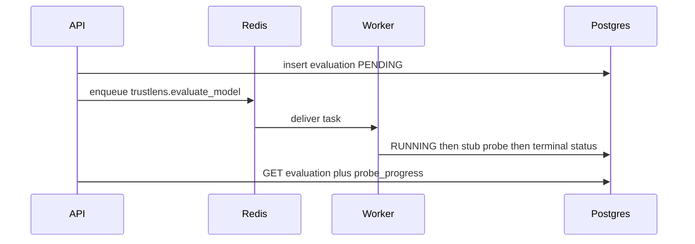

# TrustLens

Semi-automated FRIES benchmarking framework for trustworthy ML evaluations.

**Development Status:** `Phase 24 — testing hardening (lifecycle regression pack + minimal CI)`

## Prerequisites

- Docker Desktop (Compose v2)
- Python 3.11+, Node 18+ (native/hybrid)
- Optional: Make

## Quick start (Docker)

```powershell
cp .env.example .env
docker compose up --build -d
docker compose exec api alembic upgrade head
```

### Phase 5 API examples — auth + protected routes

```powershell
# Seed dev users (admin / researcher / reviewer)
make seed-users

# Login → returns { access_token, refresh_token, token_type, expires_in }
docker compose exec api curl -s -X POST http://127.0.0.1:8000/v1/auth/login `
  -H "Content-Type: application/json" `
  -d "{\"email\":\"researcher@trustlens.local\",\"password\":\"trustlens-researcher-dev\"}"

# Protected route without a token -> 401
docker compose exec api curl -s -o /dev/null -w "%{http_code}" http://127.0.0.1:8000/v1/models

# Set TOKEN to the access_token from login, then call protected routes
docker compose exec api curl -s http://127.0.0.1:8000/v1/models `
  -H "Authorization: Bearer $env:TOKEN"

# Create model (Bearer required)
docker compose exec api curl -s -X POST http://127.0.0.1:8000/v1/models `
  -H "Content-Type: application/json" -H "Authorization: Bearer $env:TOKEN" `
  -d "{\"hf_repo_id\":\"distilbert-base-uncased\",\"checksum\":\"abc123\"}"

# Create evaluation (use model id from create response); sets created_by
docker compose exec api curl -s -X POST http://127.0.0.1:8000/v1/evaluations `
  -H "Content-Type: application/json" -H "Authorization: Bearer $env:TOKEN" `
  -d "{\"model_id\":1,\"evaluation_mode\":\"AI_AUTONOMOUS\"}"

# Refresh (rotates access + refresh)
docker compose exec api curl -s -X POST http://127.0.0.1:8000/v1/auth/refresh `
  -H "Content-Type: application/json" `
  -d "{\"refresh_token\":\"<refresh_token>\"}"

# Health + OpenAPI (public)
docker compose exec api curl -s http://127.0.0.1:8000/health
# Browser: http://127.0.0.1:8000/docs (shows HTTPBearer security scheme)
```

### Phase 6 API example — import a model from Hugging Face Hub

`POST /v1/models/import-hf` resolves a user-provided HF repo id or URL via the Hub
**metadata** API (`huggingface_hub`) — model card, tags, license, file list — and upserts
the `models` registry. **It never downloads model weights.** Distinct from `POST
/v1/models`, which is a manual registry create with metadata you supply yourself.

```powershell
# Set TOKEN to an access_token from /v1/auth/login (see above)
docker compose exec api curl -s -X POST http://127.0.0.1:8000/v1/models/import-hf `
  -H "Authorization: Bearer $env:TOKEN" `
  -H "Content-Type: application/json" `
  -d "{\"repo_id\":\"distilbert-base-uncased\"}"

# Re-importing the same hf_repo_id refreshes its metadata/revision in place (no duplicate row)
docker compose exec api curl -s -X POST http://127.0.0.1:8000/v1/models/import-hf `
  -H "Authorization: Bearer $env:TOKEN" `
  -H "Content-Type: application/json" `
  -d "{\"url\":\"https://huggingface.co/distilbert-base-uncased\"}"

# List imported models
docker compose exec api curl -s http://127.0.0.1:8000/v1/models `
  -H "Authorization: Bearer $env:TOKEN"

# Non-HF URL is rejected (422 INVALID_MODEL_REF) — SSRF guard, only huggingface.co is fetched
docker compose exec api curl -s -X POST http://127.0.0.1:8000/v1/models/import-hf `
  -H "Authorization: Bearer $env:TOKEN" `
  -H "Content-Type: application/json" `
  -d "{\"url\":\"https://example.com/fake\"}"
```

Gated/private HF repos need `HF_TOKEN` set in `.env` (optional — public model metadata
import works without it). See `backend/README.md` for the adapter layout, normalized
metadata schema, and error codes.

### Phase 7 — async evaluation jobs (Celery)



`POST /v1/evaluations` returns **201 PENDING** immediately. The worker runs five
FRIES probes in **F → R → I → E → S** order — **all five are real**. Fairness,
Robustness, Integrity, Explainability (card section coverage), and Safety (mandatory
misuse/privacy/security/data disclosure checklist). Soft skips still complete the
evaluation. After success `probe_progress` is `{completed: 5, total: 5}`. Poll until
`AWAITING_REVIEW` or `FINALIZED`. Watch the worker:

```powershell
docker compose logs worker -f

# After create, poll status (set EVAL_ID)
docker compose exec api curl -s http://127.0.0.1:8000/v1/evaluations/$env:EVAL_ID `
  -H "Authorization: Bearer $env:TOKEN"
```

**Auth notes:** access tokens last 15 minutes, refresh tokens last 7 days. All `/v1/*`
routes except `/v1/auth/login` and `/v1/auth/refresh` require `Authorization: Bearer
<access_token>`. `researcher`/`reviewer`/`admin` are the three roles — reviewers/admins
are required for AI-Assisted human-review/finalize; evaluation owners or admins may
publish/unpublish. See `backend/README.md` for the full RBAC table.

**Frontend token storage (Phase 23 UI):** the demo UI stores both tokens in
`localStorage` — simple and reload-safe, but readable by any JS on the page (XSS).
Documented MVP trade-off; production should move the refresh token to an httpOnly
cookie (with `SameSite=Strict` + CSRF token) or at least `sessionStorage` + CSP.

Errors look like `{"code":"CONFLICT","message":"...","details":{...}}`. Responses include `X-Request-ID`.

### Ports

| Service | Port |
|---------|------|
| API | 8000 |
| Frontend | 5173 |
| Postgres | 5432 |
| Redis | 6379 |
| MinIO | 9000 / 9001 |

### Migrations

```powershell
make migrate
# or: docker compose exec api alembic upgrade head
```

## Layout

```text
backend/   FastAPI /v1 + HF import + Celery producer + probe plugins
worker/    Celery consumer (vendors probes + EvidenceStore)
frontend/  Vite + React (optional in Compose)
configs/   Pinned datasets_v1.yaml + experiments_v1.yaml
docs/      Runbook, results chapter, supervisor one-pager
results/   Experiment CSVs + analysis/ tables and figures
```

## Tests

```powershell
make test    # backend + worker pytest (set DATABASE_URL for the DB-backed suites)
```

The full matrix — unit vs DB vs `lifecycle` journeys vs opt-in live
`integration` runs, what is faked (Redis/MinIO/Hub/PDF), and known footguns —
lives in [backend/tests/README.md](backend/tests/README.md); the frozen FRIES
scoring vectors are documented in
[backend/tests/SCORING.md](backend/tests/SCORING.md). CI
([.github/workflows/ci.yml](.github/workflows/ci.yml)) runs backend ruff +
pytest against a Postgres service, worker ruff + pytest, and the frontend
`tsc` + `vite` build on every push/PR.

> **Seed-wipe footgun:** the migration tests downgrade to base and delete every
> row — seeded dev users included. After running the full suite against the
> Compose DB, re-run `make seed-users` before demoing.

## Confidence Engine (Phase 15)

Every probe confidence is refined at persist time from three factors ∈ [0,1] —
`data_quality`, `probe_reliability`, `evidence_completeness` — combined by
**geometric mean** (`method: "geometric_mean_v1"`). `GET /v1/evaluations/{id}`
returns a `confidence_summary` (overall = geometric mean of the five dimension
confidences; list endpoint omits it). Confidence is an **evidence-strength
signal only** — not correctness, not O/S/D — and is labeled
`proposed_calibration: true` (calibration stays open, RQ5).

## O/S/D Agent + FRIES (Phase 16)

After probes, the `HeuristicOSDAgent` proposes one O/S/D triple (0–10 ints,
higher = safer) per FRIES dimension from probe metrics/evidence — always labeled
**PROPOSED / REQUIRES VALIDATION** (`methodology_status:
"PROPOSED_REQUIRES_VALIDATION"`) and persisted to `osd_agent_outputs`. The pure
`FRIESScorer` computes the original FRIES math **only from finalized O/S/D**:
Π = ∛(O·S·D) with veto (any 0 → 0), aspect = mean of Π, T = Σ ωᵢ·Tᵢ (equal
ωᵢ = 0.2 default; each ωᵢ ≥ 0.1), validated against the frozen
`shared/scoring/fixtures/fries_test_vectors.json`. Mode behavior this phase:

- **AI_AUTONOMOUS** — agent O/S/D treated as finalized → `final_scores`
  (`fries_score`, `dimension_scores`, `finalized_osd`) → `FINALIZED`
- **AI_ASSISTED** — agent suggestion stored, evaluation stops at
  `AWAITING_REVIEW`; a human review (accept/edit) then finalize writes
  `final_scores` (Phase 18)

`GET /v1/evaluations/{id}` surfaces `osd_agent` and `final_score` on detail reads.

## Dual evaluation modes (Phase 17, ADR 0011)

Two product modes only; human review is optional **by mode**. AI-sourced O/S/D
is never presented as ground truth.

| Mode | After agent | human_reviewed | final_scores | POST finalize |
|------|-------------|----------------|--------------|---------------|
| AI_AUTONOMOUS | Auto-finalize | `false` | Written by pipeline | Idempotent 200 when FINALIZED; 409 `NOT_READY` while running; 409 `FAILED_EVALUATION` after failure |
| AI_ASSISTED | AWAITING_REVIEW | `true` after review + finalize | Written by finalize from the human-approved O/S/D | 409 `REVIEW_REQUIRED` without a human_reviews row; with one → FRIES → `final_scores` → 200 FINALIZED |

Disclaimers (verbatim, surfaced via `mode_disclosure` on evaluation detail and
denormalized onto `final_score`):

- Autonomous: `O/S/D were generated automatically and were not human-reviewed. Not ground truth.`
- Assisted (awaiting): `Awaiting human review of agent O/S/D suggestions.`
- Assisted (finalized): `Finalized O/S/D were human-reviewed (accept/edit of agent suggestions).`

Autonomous `final_scores.finalized_osd` persists `human_reviewed=false`, the
mode, and the disclaimer alongside the PROPOSED methodology label. The pipeline
stays the sole Autonomous `final_scores` writer (no recompute recovery;
re-enqueue instead).

## Human review workflow (Phase 18)

`POST /v1/evaluations/{id}/human-review` (reviewer/admin) submits a structured
accept/edit of the agent's PROPOSED O/S/D while the Assisted evaluation is at
`AWAITING_REVIEW`: `accept_all=true` takes the suggestion as-is, otherwise
per-aspect edits override and missing aspects keep agent values (humans may set
`0` = veto or `10` = optimal). Each POST appends a `human_reviews` row (audit
trail); the latest wins. `POST /finalize` then computes FRIES from the
human-approved O/S/D and persists `final_scores` with `human_reviewed=true`,
the reviewed disclaimer, and `source="human_review_assisted"` →
`FINALIZED`. The disclosure flips only after finalize.

## Reports (Phase 19, ADR 0009)

For a **FINALIZED** evaluation, `GET /v1/reports/{evaluation_id}` (Bearer auth)
returns the **canonical JSON report** (`report_v1`) embedded in the response
plus MinIO artifact URIs — the JSON is the source of truth, the PDF is a
projection of the same document rendered via Jinja2 HTML + WeasyPrint:

```bash
TOKEN=$(curl -s -X POST http://localhost:8000/v1/auth/login \
  -H 'Content-Type: application/json' \
  -d '{"email":"admin@trustlens.local","password":"trustlens-admin-dev"}' | jq -r .access_token)
curl -s http://localhost:8000/v1/reports/$EVAL_ID -H "Authorization: Bearer $TOKEN" | jq .
```

- First GET auto-generates version 1; `POST /v1/reports/{id}/generate` forces a
  new version (append-only: `reports/{evaluation_id}/v{n}/report.json` +
  `report.pdf` in MinIO — new version = new keys, old ones untouched).
- Non-finalized evaluations → `409 NOT_FINALIZED`.
- Every report is mode-labeled (AI-ASSISTED / AI-AUTONOMOUS) with the verbatim
  Phase 17/18 disclosure; the score section is explicitly `original_FRIES`
  (not FRIES2) and AI O/S/D is never called ground truth.
- PDF rendering needs WeasyPrint OS libs (Pango/HarfBuzz — bundled in
  `Dockerfile.api`); set `REPORT_PDF_ENABLED=false` to skip PDFs
  (`pdf_uri=null`, JSON still generated).

## Leaderboard (Phase 22, ADR 0013) — opt-in only

Every evaluation is **private by default** (`is_published=false`); finalize
never auto-publishes. After FINALIZED, the owner (or an admin) chooses:

```bash
POST /v1/evaluations/{id}/publish    # opt in  (409 NOT_FINALIZED before finalize)
POST /v1/evaluations/{id}/unpublish  # revoke  (clears published_at/published_by)
GET  /v1/leaderboard?task=...&dataset=...&evaluation_mode=...&limit=50&cursor=...
```

Both actions are idempotent and owner/admin-only (403 otherwise). The
leaderboard lists **only published + FINALIZED** evaluations, sorted by
original FRIES score (desc; ties by `published_at` then id), each entry
carrying its comparability context (task/dataset/config/model_revision/
trustlens_version), mode + `human_reviewed` provenance, and the latest report
URIs when a report exists. Without a `task` filter the response includes a
`note` that entries may not be comparable across tasks — there is no universal
cross-task trust ranking. Bearer auth stays required for MVP ("public" =
published-only visibility, not anonymous access).

## UI demo (Phase 23)

The React dashboard covers the whole journey without curl. Start the stack and
open `http://localhost:5173` (Compose runs the Vite dev server; natively:
`cd frontend && npm install && npm run dev`):

```powershell
docker compose up --build -d
docker compose exec api alembic upgrade head   # first run
make seed-users                                # dev logins below
```

> Re-run `make seed-users` if the backend test suite ran against this database
> — the migration tests wipe all rows, dev logins included.

1. **Researcher** (`researcher@trustlens.local` / `trustlens-researcher-dev`):
   Import HF model (`distilbert-base-uncased-finetuned-sst-2-english` or
   `prajjwal1/bert-tiny`) → open it → create an **AI-Autonomous** evaluation
   (set a task, e.g. `sentiment`) → the detail page polls to FINALIZED → View
   report (generates on first open) → **Publish to leaderboard** → Leaderboard
   page lists it.
2. Create an **AI-Assisted** evaluation on the same model — it parks at
   AWAITING REVIEW and the researcher only sees *waiting for reviewer*.
3. **Reviewer** (`reviewer@trustlens.local` / `trustlens-reviewer-dev`): open
   that evaluation → **Review agent O/S/D** → accept all or edit values →
   submit + finalize → FRIES appears and the report is marked *human-reviewed*.
4. Back as the researcher: publish the assisted run; both entries show on the
   leaderboard (filter by mode/task).

Every page shows the mandatory mode disclosure; agent O/S/D stays labeled
**PROPOSED — not ground truth**. UI role gating mirrors backend RBAC (the API
enforces it regardless). See [frontend/README.md](frontend/README.md) for
routes and the localStorage token trade-off.

## What Phase 23 does **not** include

Attack simulation (Phases 20–21, post-MVP), anonymous public access / CDN,
auto-publish on finalize, new tables (ADR 0013 uses
`evaluations.is_published`), FRIES2 sections, cryptographic report signing,
validated metric→O/S/D science or an LLM agent, SHAP/LIME, OAuth/SSO,
pixel-perfect design system / MUI, E2E Playwright suite (manual demo checklist
above).

## Research experiments (Phase 25–26)

The Mode A/B/C benchmark (6 HF models × 3 seeds Mode C + determinism check,
an assisted-review subset, and a manual FRIES rubric baseline) is fully
scripted and documented in
[docs/experiments_runbook.md](docs/experiments_runbook.md) — pinned
`probe_config`, dataset revisions, model set with the expected skip matrix,
and honest limitations (model-independent fairness proxy, `ai-provisional`
human passes). Config: [configs/experiments_v1.yaml](configs/experiments_v1.yaml);
runner/export: `python -m app.scripts.run_experiments` /
`export_experiment_results` (from `backend/`); raw tables committed under
`results/` (`mode_c_runs.csv`, `mode_c_summary.csv` with per-model std,
`mode_b_reviews.csv`, `mode_a_manual.csv`).

Phase 26 analysis (no experiment re-run): `python -m app.scripts.analyze_experiments`
writes [`results/analysis/`](results/analysis/) (T1–T7, F1–F5). Results
chapter: [`docs/results_chapter.md`](docs/results_chapter.md). Supervisor
one-pager: [`docs/RESULTS_SUMMARY.md`](docs/RESULTS_SUMMARY.md).

**Next:** a human Mode A/B panel, or stop at the MVP demo. Phases 20–21
(attack simulation) and full Phase 27 CD remain post-MVP.