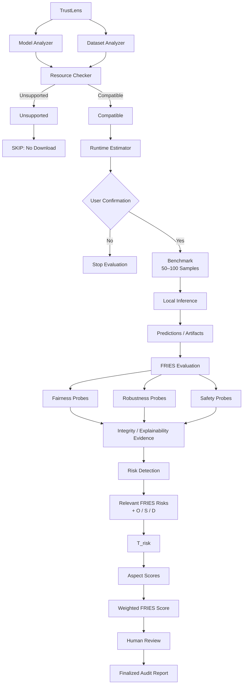

# TrustLens

Evidence-driven, risk-based auditing and benchmarking for machine-learning models.

TrustLens organizes evaluation around five FRIES dimensions — **Fairness, Robustness, Integrity, Explainability, and Safety** — and treats the overall FRIES number as a **traceable aggregation of risk assessments**, not as an objective or absolute measure of model safety or trustworthiness.

This README describes **what TrustLens is intended to become**, **what the repository currently implements**, and **what remains to be built**. Claims about current behavior are taken from the code. Claims about target methodology follow the TrustLens architecture specification.

## Vision

The intended system is a local-first platform that:

1. Imports a Hugging Face model and checks whether it can run on the available machine.
2. Collects **measured evidence** (metrics, hashes, documentation coverage, behavioral tests).
3. Maps that evidence onto **relevant FRIES risks**.
4. Proposes **Occurrence / Severity / Detection (O/S/D)** ratings.
5. Computes risk trust scores, aspect scores, and a weighted overall FRIES score.
6. Exposes every step for **human review and audit**.

The conceptual pipeline is:

```text
Measured evidence
       ↓
Relevant FRIES risk
       ↓
O / S / D assessment
       ↓
Risk trust score  T_risk = ∛(O × S × D)
       ↓
Aspect score
       ↓
Weighted FRIES score
```

TrustLens must never collapse a raw metric into a dimension score. Demographic parity difference is evidence of disparity, not the Fairness score. Documentation coverage is evidence of transparency, not the Explainability score. An unsafe-response rate is evidence for a safety risk, not the Safety score. An artifact hash is evidence of identity, not the Integrity score.

The FRIES score is a **systematic, interpretable, reproducible audit artifact**. It is not a scientific proof that a model is fair, robust, or safe.

## Methodology

### Three layers

| Layer | What it is | What it is not |
| ----- | ---------- | -------------- |
| **A. Measured evidence** | Probe outputs: DPD, EOD, F1 gap, clean vs perturbed accuracy, SHA-256, card coverage, entropy, and similar measurements | A FRIES dimension score |
| **B. Risk assessment** | Selecting relevant FRIES risks and assigning inverted O/S/D (heuristic unless empirically validated) | Automatic proof that a risk is present or absent |
| **C. FRIES score** | Geometric risk scores, aspect averages, weighted overall T | An objective ranking of models across unrelated tasks |

### O/S/D (FRIES convention)

FRIES adapts FMEA but **inverts** the usual meaning so that **higher values mean greater trustworthiness** (0–10):

- **O (Occurrence)** — higher means the risk is less likely.
- **S (Severity)** — higher means the potential impact is less severe.
- **D (Detection)** — higher means the risk is easier to detect.

A high ordinary FMEA score means high risk. A high FRIES O/S/D score means the opposite. Confusing the two is a correctness failure.

### Scoring (target and implemented math)

For each selected risk:

```text
T_risk = ∛(O × S × D)
```

Edge cases from the original FRIES algorithm, as implemented in `backend/app/scoring/fries.py`:

- Any of O, S, D equal to **0** (veto / deficit) → `T_risk = 0`.
- O = S = D = **10** (optimal) → `T_risk = 10`.

The aspect score is the mean of selected risk scores for that aspect. Overall FRIES is:

```text
FRIES = w_F T_F + w_R T_R + w_I T_I + w_E T_E + w_S T_S
```

Default weights are equal (`0.2` each). Custom weights must be documented in the report. The original methodology typically selects **1–3 relevant risks per aspect**.

Metric → O/S/D bands in this project are **heuristics**. They are labeled `PROPOSED / REQUIRES VALIDATION` and are not published scientific conversions.

### Evidence status (target)

Unavailable evidence must not become a fabricated numeric score. Intended statuses:

| Status | Meaning |
| ------ | ------- |
| `EVALUATED` | Required evidence was measured; O/S/D may exist |
| `INSUFFICIENT_EVIDENCE` | Required inputs were missing — do not invent O/S/D |
| `NOT_APPLICABLE` | Risk is not meaningful for this model/task |
| `SKIPPED` | Intentionally not run |
| `FAILED` | Attempted and failed technically |
| `PROXY` | A substitute model or dataset was used — must be labeled, never silent |

When an entire aspect cannot be evaluated, the overall FRIES score should be marked **partial** (reweight evaluated aspects) or **withheld**. Do not fill the gap with 0 or 1.

## Current implementation

TrustLens today is a **working v1 product** over **Layer A probe evidence**: FastAPI + Celery + React, Hugging Face **metadata** import, five FRIES probes, a default **deterministic** O/S/D mapper that **abstains**, original FRIES math when complete O/S/D exist, dual **workflow** modes, human review, versioned JSON/PDF reports, an opt-in FRIES-only leaderboard, and append-only MinIO evidence.

Default evaluations **do not invent O/S/D**. FRIES is **withheld** (status still `FINALIZED`; no `final_scores` row). That is not a low trust score.

### What works

- **Auth and RBAC** — researcher / reviewer / admin JWT roles.
- **Model registry** — `POST /v1/models/import-hf` resolves Hub **metadata only** (card, tags, license, file list). It does **not** download weights.
- **Async evaluations** — `POST /v1/evaluations` enqueues `trustlens.evaluate_model`; probes run F → R → I → E → S.
- **Probes emit metrics and evidence**, not FRIES scores. Confidence is an **uncalibrated evidence-strength** geometric mean (`data_quality`, `probe_reliability`, `evidence_completeness`) — not correctness and not O/S/D.
- **Assessment engine (orthogonal to workflow mode)**
  - **Default `deterministic`** — O/S/D are not generated (no validated mapping). FRIES withheld.
  - **`legacy_heuristic`** — admin-only, **top-level** `probe_config.assessment_engine` only. `extra.assessment_engine` (including `"heuristic"`) is ignored. HeuristicOSDAgent still exists for this path; it is not an LLM.
- **Workflow modes** (`AI_AUTONOMOUS` / `AI_ASSISTED`) are **human-review gates**, not LLM interpretation. Enum names are historical.
  - `AI_AUTONOMOUS` — pipeline may finalize without a reviewer (`human_reviewed=false`).
  - `AI_ASSISTED` — stops at `AWAITING_REVIEW`; a reviewer records or edits O/S/D, then finalize.
- **Original FRIES scorer** — cube-root risk scores, veto, aspect mean, weighted total; frozen vectors in `shared/scoring/fixtures/fries_test_vectors.json`. Runs only when complete numeric O/S/D exist (legacy/admin or human-supplied complete triples).
- **Reports** — canonical `report_v1` JSON in MinIO when FRIES was scored; PDF is a projection. Append-only versions. Finalized + withheld FRIES returns 409 (not “not finalized yet”).
- **Leaderboard** — private by default; owner/admin publish after FINALIZED **and** a FRIES score exists. Not a universal trust ranking.
- **Evidence store** — SHA-256 artifacts in MinIO, evaluation-scoped.

### Open methodology questions (recorded, not solved in this freeze)

- Amendment **A6** vs default withhold: whether/when a partial FRIES should exist without a validated O mapping.
- Confidence factor weights remain **uncalibrated** (`proposed_calibration`).
- Mode B / `llm_assisted` O/S/D is **not implemented**.

### How probes actually run

| Dimension | Current evidence | Runs the imported model? |
| --------- | ---------------- | ------------------------ |
| **Fairness** | Adult Census tabular subset; demographic parity difference, equalized odds difference, subgroup F1 spread | **No.** Default predictor is a sklearn `LogisticRegression` fit on the subset — a **proxy**, not the imported HF model |
| **Robustness** | Pinned NLP subset; clean vs character-swap accuracy | **Yes**, for text-classification models (`transformers` on CPU). Other modalities skip the attack |
| **Integrity** | Hub identity/disclosure Layer A evidence (revision format, file manifest, structured license, card, repro keywords, listing fingerprint). Named `I-INT-*` risks; optional injected hash compare. **No** `integrity_score_0_10` | No weight download in production; hash compare only when operator/test supplies both hashes |
| **Explainability** | Model-card ATX section coverage (intended use, limitations, training data, evaluation, ethical considerations) | Metadata only; not SHAP/LIME |
| **Safety** | Mandatory disclosure checklist (misuse / privacy / security / data) plus high-impact claim flags | Metadata only; no behavioral unsafe-prompt suite |

### Known methodological gaps (present in code)

These are the main deviations from the target architecture:

1. **One O/S/D triple per dimension**, not a catalog of 1–3 selected FRIES risks with structured mapping traces (`rule_id`, band, rationale, methodology version).
2. **Heuristic agent always proposes numbers**, including skip/empty-card defaults such as `(4, 4, 3)` or `(2, 2, 3)`. Skipped fairness/robustness and missing evidence still become numeric O/S/D.
3. **No first-class evaluation statuses** (`EVALUATED`, `INSUFFICIENT_EVIDENCE`, `NOT_APPLICABLE`, `SKIPPED`, `FAILED`, `PROXY`). Soft skips complete the job and still feed the scorer.
4. **Fairness does not evaluate the imported model.** Proxy behavior is documented in code comments but is not a first-class `PROXY` path in the product.
5. **Coverage ratios and integrity pass rates are still easy to confuse with aspect scores.** The scorer uses O/S/D, but the agent bands those O/S/D values directly from coverage / pass rate / disparity — closer to “metric → dimension rating” than “evidence → named risk → O/S/D”.
6. **Overall FRIES always assumes five aspects.** Missing dimensions are not withheld or reweighted; empty risk lists currently score as `0`.
7. **No resource checker, compatibility states, or benchmark-first runtime estimate** before download. HF import never downloads weights; robustness may download a sequence-classification model at probe time with no VRAM/RAM/disk gate.
8. **No shared inference backend.** Only the robustness NLP runner loads the imported model.
9. **Integrity Phase 3** records named Layer-A risks (`I-INT-*`) from Hub metadata; it does not claim tampering, true lineage, or a generic integrity score. Production hash verification is deferred; optional injected compare for tests/operators only.
10. **Safety has no behavioral test set.** Governance coverage is the evidence.
11. **Reports are still score-centric** relative to the target (limited hardware, mapping-trace, and limitation sections).
12. **Historical results** are version-stamped (`evaluations.trustlens_version`) but there is no separate methodology version for heuristic bands vs scorer math.

The research experiment CSVs under `results/` were produced under this older methodology. They must not be silently rewritten.

## Target architecture

Local Hugging Face execution is the intended default. Hosted inference is not required for the core system. Compatibility must treat **disk, RAM, and VRAM as separate constraints** (reference machine in the spec: RTX 4060 Laptop, 8 GB VRAM, 16 GB RAM). Parameter-count heuristics are estimates with safety margin, not hard guarantees.

## Roadmap

Work is ordered to match the specification’s implementation phases. Items already in the repo are marked.

| Phase | Intent | Status |
| ----- | ------ | ------ |
| 1 | Probe evaluation statuses, nullable O/S/D, status-aware runner | **Absent** |
| 2 | Model analyzer + disk/RAM/VRAM compatibility (`SUPPORTED` / `CONSTRAINED` / `UNSUPPORTED` / `UNKNOWN`) | **Absent** |
| 3 | `InferenceBackend` / `LocalInferenceBackend`; evaluation separated from execution | **Partial** (robustness NLP load only) |
| 4 | Short benchmark, throughput, runtime estimate, optional cache | **Absent** |
| 5 | Fairness on the **imported** model; explicit legacy proxy mode | **Partial** (metrics exist; predictor is proxy LR) |
| 6 | Robustness on the imported model; skipped/N/A must not invent O/S/D | **Partial** (NLP char-swap exists; skip still bands O/S/D) |
| 7 | Integrity as FRIES risk taxonomy + provenance/hash/uncertainty evidence | **Partial** (metadata checklist) |
| 8 | Explainability as documentation/transparency **risks**, not coverage-as-score | **Partial** (card coverage) |
| 9 | Safety behavioral + governance evidence → risks | **Partial** (governance checklist only) |
| 10 | Explicit mapping rules, traces, methodology version | **Partial** (free-text rationales; no structured trace) |
| 11 | Multi-risk aspect aggregation; partial FRIES / withhold policy | **Partial** (math exists; always five aspects; empty → 0) |
| 12 | Reports/UI: evidence, statuses, limitations, calculation breakdown | **Partial** (reports + UI exist; not limitation-complete) |
| 13 | Regression suite covering statuses, proxy, mapping, partial FRIES | **Partial** (strong probe/API/lifecycle tests; status enum untested because absent) |

Also remaining (product, not FRIES math): attack-simulation phases, anonymous public leaderboard, cryptographic report signing, SHAP/LIME as optional explainability extensions, calibrated O/S/D science, OAuth/SSO.

**Non-goals:** do not add an ML model that predicts trustworthiness or classifies risk. Do not treat proxy evaluation as direct evaluation. Do not present heuristic thresholds as empirically validated.

## Repository layout

```text
backend/   FastAPI /v1, probes, O/S/D agent, FRIES scorer, reports
worker/    Celery consumer (same probe pipeline)
frontend/  Vite + React dashboard
configs/   Pinned datasets_v1.yaml + experiments_v1.yaml
docs/      Experiment runbook and results write-up
results/   Frozen experiment CSVs (do not silently rewrite)
shared/    Frozen FRIES scoring fixtures
```

API detail, RBAC, and probe formulas: [backend/README.md](backend/README.md).  
Worker: [worker/README.md](worker/README.md).  
UI routes: [frontend/README.md](frontend/README.md).  
Test matrix: [backend/tests/README.md](backend/tests/README.md).  
Scoring oracle: [backend/tests/SCORING.md](backend/tests/SCORING.md).

## Quick start

**Prerequisites:** Docker Desktop (Compose v2). Python 3.11+ and Node 18+ for native/hybrid runs. Optional: Make.

**Local backend setup (terminal):** see **[docs/LOCAL_DEVELOPMENT.md](docs/LOCAL_DEVELOPMENT.md)** for venv, `.env`, migrations, tests, and native API commands.

```powershell
cp .env.example .env
docker compose up --build -d
docker compose exec api alembic upgrade head
make seed-users
```

| Service | Port |
| ------- | ---- |
| API | 8000 |
| Frontend | 5173 |
| Postgres | 5432 |
| Redis | 6379 |
| MinIO | 9000 / 9001 |

**GPU:** `docker compose up --build -d` requests NVIDIA GPU passthrough for the `worker` service by default (Compose Spec device reservation). On a host with an NVIDIA GPU:
- Linux: install the [NVIDIA Container Toolkit](https://docs.nvidia.com/datacenter/cloud-native/container-toolkit/latest/install-guide.html) and restart Docker.
- Windows: use Docker Desktop with the WSL2 backend and a standard NVIDIA driver (no extra toolkit needed).

Verify first with `nvidia-smi` (host) then `docker run --rm --gpus all nvidia/cuda:12.4.0-base-ubuntu22.04 nvidia-smi` (Docker GPU access). If you don't have an NVIDIA GPU/toolkit at all, the default `deploy` reservation makes `docker compose up` fail outright — use the CPU-only override instead:

```powershell
docker compose -f docker-compose.yml -f docker-compose.cpu-only.yml up --build -d
```

Either way, CPU vs CUDA selection *inside* the worker is always detected at runtime (`backend/app/inference/device.py`) — the Compose files only control whether Docker exposes the GPU device at all. Each evaluation's actual execution device (and a real GPU name, or an explicit fallback reason) is persisted on `evaluations.execution_metadata` and shown on the evaluation detail page — never assumed from configuration alone.

Open `http://localhost:5173`. Dev logins:

| Role | Email | Password |
| ---- | ----- | -------- |
| Researcher | `researcher@trustlens.local` | `trustlens-researcher-dev` |
| Reviewer | `reviewer@trustlens.local` | `trustlens-reviewer-dev` |
| Admin | `admin@trustlens.local` | `trustlens-admin-dev` |

Typical demo: import a small text-classification Hub id (for example `distilbert-base-uncased-finetuned-sst-2-english` or `prajjwal1/bert-tiny`) → create an **auto-finalize** evaluation (default deterministic engine) → wait for `FINALIZED` → inspect probe evidence. O/S/D show **Unavailable** and **FRIES is withheld**. Researchers cannot select `legacy_heuristic`; admins may set top-level `probe_config.assessment_engine` to score a legacy FRIES path. For **human review before finalize**, a reviewer records O/S/D, then finalize.

Gated Hub repos need `HF_TOKEN` in `.env`. Access tokens last 15 minutes; refresh tokens last 7 days. The demo UI stores tokens in `localStorage` (XSS-readable) — an MVP trade-off, not a production auth design.

OpenAPI: `http://localhost:8000/docs`. Health: `GET /health`.

```powershell
make test-backend   # same as CI: -m "not integration", needs Postgres
make test-unit      # skips lifecycle/slow; OK without Postgres
```

CI (`.github/workflows/ci.yml`) runs ruff + pytest (Postgres service) and the frontend `tsc` + Vite build.

> After the full backend suite against the Compose database, re-run `make seed-users`. Migration tests wipe all rows, including seeded users.

## Using the product honestly

- Default O/S/D are **not generated**. Legacy heuristic values (admin path) are **proposed**, not ground truth, and not an LLM.
- Confidence is **uncalibrated evidence strength**, not model quality. The FRIES hero does not show OSD-mean “confidence”.
- Fairness numbers on the default path describe a **tabular logistic-regression proxy**, not the imported NLP model (unless a supported pairing is used).
- Robustness numbers describe **character-swap** degradation on supported text classifiers only.
- Integrity uses Layer A Hub identity/disclosure evidence. Named risks use `aspect_scoring=risk_detected` — **not** an Integrity FRIES score.
- Leaderboard entries are comparable only with shared task/dataset/config/revision context.

## License and research

Experiment protocol and limitations: [docs/experiments_runbook.md](docs/experiments_runbook.md).  
Analysis: [docs/results_chapter.md](docs/results_chapter.md), [docs/RESULTS_SUMMARY.md](docs/RESULTS_SUMMARY.md).
