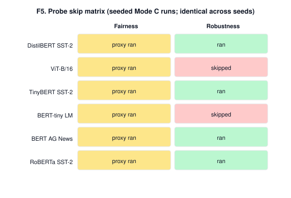
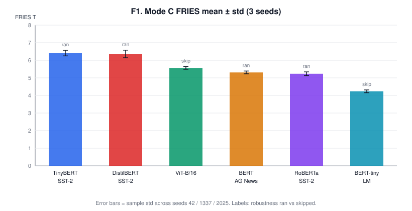
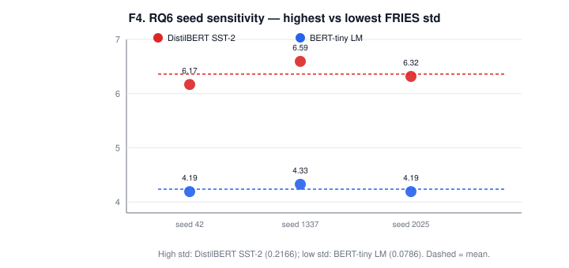
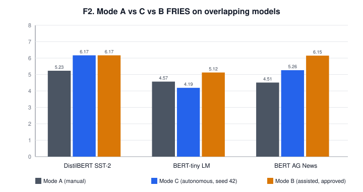
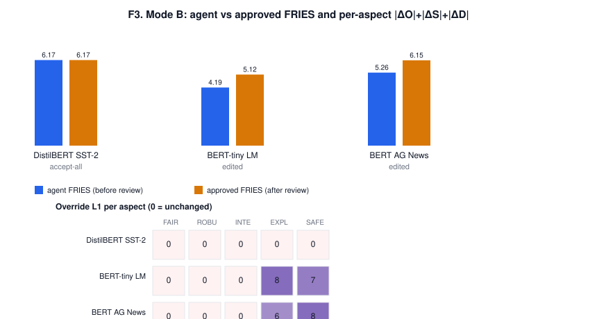

# TrustLens Phase 26 — Results

This chapter answers RQ1–RQ6 from the Phase 25 benchmark CSVs. It is a
**results** write-up, not a methods paper: protocol, pins, and commands live in
[`experiments_runbook.md`](experiments_runbook.md). Tables and figures are
regenerated from `results/mode_*.csv` by
`python -m app.scripts.analyze_experiments` (run from `backend/`) into
[`results/analysis/`](../results/analysis/). Machine-readable copies of every
table are in that folder; a concatenated markdown dump is
[`results/analysis/TABLES.md`](../results/analysis/TABLES.md).

**Provenance, stated once.** HeuristicOSDAgent O/S/D is
`PROPOSED_REQUIRES_VALIDATION` — not ground truth, not a validated
metric→O/S/D science. Mode A and Mode B passes in this corpus are labeled
`ai-provisional` (one AI-assistant rater, card-only for Mode A). They are
protocol placeholders for a human panel, not expert agreement. N is small
(6 models, 3 seeds, 3 overlapping models for A/B/C). No result below is a
significance claim.

Attack-detection metrics (Phases 20–21) and FRIES2 were **not executed** and
are out of scope.

---

## 1. Setup recap

| Item | Value |
|------|-------|
| Platform | TrustLens **0.20.1**, original FRIES (`Π = ∛(O·S·D)`, equal weights) |
| Mode C | 6 HF models × seeds `{42, 1337, 2025}` = 18 runs, all `FINALIZED`, plus one same-seed determinism check |
| Mode B | 3 models at seed 42 (`AI_ASSISTED`): DistilBERT SST-2 accept-all; BERT AG News and BERT-tiny LM edited then finalized |
| Mode A | Same 3 models; paper rubric on the model card only, blind to TrustLens output |
| Overlap for A/B/C | DistilBERT SST-2, BERT AG News, BERT-tiny LM |
| Datasets | Pinned in `configs/datasets_v1.yaml` (namespaced repos; see runbook — canonical ids failed at pilot) |

The five FRIES probes ran on every evaluation. Fairness is a **proxy
LogisticRegression on Adult census** and never loads the HF model. Robustness
is a CPU char-swap attack and **soft-skips** unless `pipeline_tag` is
text-classification / sentiment. Integrity, explainability, and safety are
card/metadata heuristics.

---

## 2. RQ1 — Can objective FRIES-related evidence be auto-collected?

**Short answer:** yes for pipeline reliability (90/90 probe slots completed
without a hard fail; 84/90 produced a non-skip metric), with two structural
caveats: fairness metrics are not about the HF model, and robustness only
runs on text classifiers.

**Table (RQ1 coverage, 6 models × 3 seeds).** Source:
`results/analysis/rq1_probe_coverage.csv`.

| Probe | Metrics produced | Skipped | Skip rate | What “produced” means |
|-------|------------------|---------|-----------|------------------------|
| Fairness | 18/18 | 0 | 0 | DP/EO on Adult proxy LR — **model-independent** |
| Robustness | 12/18 | 6 | 0.33 | Char-swap accuracies on 4/6 models; skip reason `model is not text-classification / sentiment` on BERT-tiny LM and ViT-B/16 |
| Integrity (card) | 18/18 | 0 | 0 | Metadata pass-rate |
| Explainability (card) | 18/18 | 0 | 0 | Header-coverage ratio (0.00 is still a number) |
| Safety (card) | 18/18 | 0 | 0 | Same coverage heuristic |
| **All slots** | **84/90** | **6** | **0.067** | Only robustness actually skips |

Automation ratio for *objective measurement steps that finish*: **100%** of
created evaluations reached `FINALIZED` (19/19 including the det-check; 3/3
Mode B reached `AWAITING_REVIEW` then `FINALIZED`). Evidence artifacts were
written for every probe.

That does **not** mean every dimension has model-faithful evidence:

- Fairness O/S/D is identical across models at a fixed seed (visible in T2:
  Fairness *Tᵢ* mean = **7.5457** for all six). The probe collected real
  Adult DP/EO numbers (`dp_diff` 0.009–0.203 depending on seed) and mapped
  them; it did not evaluate the HF head.
- Explainability/safety “metrics” are documentation coverage, not
  interpretability or harm evaluations. A coverage of 0.00 still counts as
  collected evidence — and is exactly what later collapses the agent into
  O=S=D=1 (RQ5).

**RQ1 support, qualified:** the MVP can auto-collect a complete evidence
package for small HF models on CPU, with documented skip behaviour. It does
not yet collect *the* FRIES-relevant measurement for every aspect on every
modality.

---

## 3. RQ6 — How stable are autonomous scores across repeats?

Repeats vary `probe_config.extra.seed`. The rest of the stack is
deterministic (heuristic agent, pinned dataset SHAs, CPU argmax). Std across
seeds is therefore **seed/sampling sensitivity**, not worker jitter.

**T1 — Mode C FRIES mean ± std (3 seeds).** Matches `mode_c_summary.csv`
(asserted by the analysis script).

| Model | FRIES mean ± std | Robustness |
|-------|------------------|------------|
| TinyBERT SST-2 | 6.41 ± 0.16 | ran |
| DistilBERT SST-2 | 6.36 ± 0.22 | ran |
| ViT-B/16 | 5.57 ± 0.08 | skipped |
| BERT AG News | 5.31 ± 0.08 | ran |
| RoBERTa SST-2 | 5.23 ± 0.11 | ran |
| BERT-tiny LM | 4.24 ± 0.08 | skipped |

Per-model std is **0.08–0.22** on a 0–10 scale (coefficient of variation
≈ 1.4–3.4%). Skip-contrast models sit at the floor of that range because
robustness O/S/D is a constant default band; the only seed-varying dimension
they have is fairness (proxy LR `random_state`). Classifiers move more:
fairness O/S and robustness S/D both step by one band across seeds
(`mode_c_summary.csv` O/S/D std columns).

**T7 — determinism check.** TinyBERT SST-2, seed 42, `repeat=det-check` vs
`seed-42`: **identical** on 22 compared keys (FRIES, all O/S/D, confidence,
fairness DP/EO, robustness accuracies). Fixed-seed re-runs are bit-stable;
the 0.08–0.22 std is seed sensitivity, not nondeterminism.

**RQ6 support, for this MVP:** autonomous FRIES is stable enough to report a
mean, and a same-seed re-run reproduces exactly. It is not “the score of the
model independent of subsample” — changing the seed moves fairness (all
models) and robustness (classifiers) by about one O/S/D band.

---

## 4. RQ2 / RQ3 / RQ4 — Mode A vs B vs C

Overlap is three models and **one** `ai-provisional` Mode A rater. Pearson /
Spearman on n=3 are reported as descriptive summaries, not tests. Cohen’s
kappa is omitted (one rater; no pre-registered band discretization).

**T3 — FRIES on the overlap (Mode C = seed 42, matching Mode B).**

| Model | A (manual) | C (auto) | B (approved) | C − A | B − A | B − C |
|-------|------------|----------|--------------|-------|-------|-------|
| DistilBERT SST-2 | 5.23 | 6.17 | 6.17 | +0.94 | +0.94 | 0.00 |
| BERT AG News | 4.51 | 5.26 | 6.15 | +0.75 | +1.64 | +0.89 |
| BERT-tiny LM | 4.57 | 4.19 | 5.12 | −0.38 | +0.55 | +0.93 |

Agreement (FRIES): A vs C Pearson **0.80**, Spearman **0.50**, MAE **0.69**;
A vs B Pearson **0.45**, Spearman **0.50**, MAE **1.04**. Mean absolute
O/S/D cell error: A vs C **2.60**, A vs B **1.96** (45 cells = 15 aspects ×
3 components). Full aspect table: `t3_abc_aspect_osd.csv`.

### RQ2 — Agent vs manual

The agent is **not** interchangeable with the card-only rubric on this set.

- Systematic pattern: Mode C **over-scores fairness** relative to A (Adult
  proxy looks “fine”, so O/S land at 7–8; the Mode A pass scored documented
  or inherited bias at 3–4). Mode C **under-scores explainability/safety on
  thin cards** (coverage 0.00 → O=S=D=1; Mode A gave mid-range 3–6 because
  *some* documentation exists even without standard headers).
- DistilBERT is the closest: rich card, robustness actually ran, accept-all
  in Mode B. Residual gap (+0.94 FRIES) is mostly fairness (A 3/5/8 vs C
  7/7/8) and integrity S (A=4 vs C=9 — the agent treats a metadata pass-rate
  of 1.00 as near-negligible impact).
- BERT AG News robustness is the largest single-cell disagreement: A 3/6/5
  vs C 9/9/9. The probe measured clean acc 1.00 / robust acc 0.98 / ASR
  0.016 on 64 AG News rows — objectively strong under this attack — while
  the Mode A pass, looking only at a five-line card with no adversarial
  numbers, assumed BERT-base is “reliably attackable.” That is a
  **methods clash** (probe evidence vs prior), not a scoring bug.

**RQ2 is not supported** as “sufficient agreement with experts.” It *is*
informative: disagreements concentrate where the MVP is known-weak (proxy
fairness, header-coverage cards) or where Mode A had no probe numbers
(robustness). A human panel looking at the same evidence package could move.

### RQ3 — Assisted vs autonomous

**T4.** Override rate **4/15 aspects (0.267)**; 2/3 models edited. DistilBERT
accept-all reproduced autonomous FRIES exactly (**6.1681**), which is the
expected identity: same agent, same seed, no edits. The two edits were
exclusively **EXPLAINABILITY and SAFETY** on the thin-card models, raising
uniform 1/1/1 triples to 3/4/2–3/5/3 (AG News) and 3/5/3–3/5/2 (BERT-tiny).
Approved FRIES rose by **+0.89** and **+0.93**. Fairness, robustness, and
integrity were left as proposed.

Autonomous and assisted are **indistinguishable** when the reviewer accepts
all, and **differ by ~0.9 FRIES** when the reviewer rejects the
coverage→O/S/D collapse. That difference is interpretable (RQ3 support for
“when autonomy is questionable”: thin cards / low explainability-safety
confidence). It is not a human-validated correction.

### RQ4 — Does assisted reduce effort while keeping agreement with A?

**Effort.** Mode A rubric time on the three models was **12–15 minutes**
each (sum of per-aspect `minutes_spent`; 40 minutes total). Mode C warm-cache
wall-clock is **5–15 s** (T5; first run per model is an HF-download outlier,
up to 91 s for BERT AG News). Mode B pipeline wall to `AWAITING_REVIEW` is
the same order as a warm Mode C run (5–20 s). **Review duration was not
instrumented** — T5 leaves `mode_b_review_minutes` empty. We cannot claim a
measured human-time saving for the assisted step; we can only say the
machine portion is seconds, and the reviewer edited 4 aspects rather than
scoring 15 O/S/D cells from scratch.

**Agreement vs A.** Assisted **lowered** mean O/S/D error vs A (2.60 → 1.96)
because E/S edits moved those cells toward the Mode A mid-range. It
**worsened** FRIES MAE vs A (0.69 → 1.04) because lifting E/S from 1 to ~3–5
raises the geometric mean a lot, while Mode A’s overall T was already ~4.5–5.2.
On FRIES, accept-all DistilBERT is identical to C; the two edits moved *away*
from A.

**RQ4 is not supported** on this corpus: effort reduction is plausible but
unmeasured for the human step, and FRIES agreement with A did not improve.
The useful observation is narrower: assisted review is where the
header-coverage failure is catchable (RQ5).

---

## 5. RQ5 — Confidence when evidence is incomplete or ambiguous

**T6 — models ranked by `overall_confidence` (constant across seeds).**

| Model | overall | Expl. conf. | Safety conf. | Robustness skip | Mode B |
|-------|---------|-------------|--------------|-----------------|--------|
| DistilBERT SST-2 | 0.87 | 0.80 | 0.56 | no | accept-all (L1=0) |
| TinyBERT SST-2 | 0.87 | 0.80 | 0.56 | no | — |
| ViT-B/16 | 0.78 | 0.80 | 0.56 | yes | — |
| BERT AG News | 0.73 | 0.33 | 0.39 | no | edited (L1=14) |
| RoBERTa SST-2 | 0.67 | 0.29 | 0.29 | no | — |
| BERT-tiny LM | 0.64 | 0.33 | 0.39 | yes | edited (L1=15) |

Confidence **does fall** on thin cards (explainability/safety confidence
0.29–0.39 vs 0.80/0.56 on DistilBERT-class cards) and modestly on robustness
skips (point-biserial overall vs skip ≈ **−0.39**, n=6, descriptive). The two
Mode B edits are exactly the two overlap models with low card-like
confidence; DistilBERT (high card confidence) was accept-all. That is the
direction RQ5 hoped for.

**The failure mode is not “confidence stays high under ambiguity.”** It is
that **low confidence still emits a concrete O/S/D triple**, and the mapping
treats missing section *headers* as extreme risk (O=S=D=1) rather than
“unknown / abstain.” Both thin-card models had coverage_ratio=0.00 despite
cards that *do* document task, training, and provenance — they just lack
the headings the heuristic looks for. Mode B overrides exist to undo that
collapse. The agent never abstained.

**RQ5 mixed.** Confidence is a usable *ranking* signal for “this card is
thin; look at it.” It is not a calibrated probability of disagreement, and
it does not gate autonomous finalization. Miscalibration here is in the
**O/S/D mapping**, not in the confidence scalar staying high.

---

## 6. Threats to validity

Adapted from the roadmap list and the Phase 25 runbook.

1. **Small N.** Six models, three seeds, three-model A/B/C overlap. Std and
   correlations are indicative. No inferential statistics are claimed.
2. **Single, provisional rater.** Mode A and Mode B are `ai-provisional`.
   Experiments.md asked for ≥2 human reviewers; that panel was not run.
   RQ2/RQ4 cannot be read as expert agreement.
3. **Proposed agent.** Heuristic metric→band rules. Results measure the
   *pipeline*, not a validated O/S/D methodology (Phase 0 ORQ-1/ORQ-2 remain
   open).
4. **Shallow probes.** Fairness never scores the HF model. Robustness is
   one discrete char-swap with 64 rows. Explainability/safety are card
   headers, not SHAP/LIME or red-teaming.
5. **Fairness model-independence** makes cross-model fairness rankings
   meaningless by construction. Seed-to-seed fairness movement is the Adult
   subsample, not the model.
6. **Dataset-pin bug fixed mid-pilot.** Canonical Hub ids (`glue`,
   `ag_news`) no longer load on the worker’s `datasets` version; the first
   pilot silently skipped robustness. The committed CSVs are from the
   rebuilt worker with namespaced pins. Pre-fix numbers were discarded.
7. **HF models ≠ high-stakes systems.** SST-2 / AG News / ImageNet-class ViT
   / a 4.4M LM stub are convenience models for a CPU thesis demo, not
   medical or credit models the FRIES paper’s severity scale contemplates.
8. **Wall-clock contamination.** Client poll interval 5 s; first run per
   model includes download; no per-probe duration columns in the DB.
9. **Mode A was blind to probe evidence.** That is the protocol (card-only
   baseline) but it inflates A–C disagreement on dimensions the probes
   actually measured (especially AG News robustness).
10. **No attack cohort.** RQ-adjacent claims about manipulation detection
    are not testable here.

---

## 7. Limitations and future work

**Limitations already visible in the tables**

- Autonomous FRIES on this set is largely a **card-quality + robustness-skip
  + Adult-proxy** score. Model ranking in T1 is not “which classifier is
  fairer.”
- Header-based card coverage is a brittle proxy for documentation quality
  (Mode B finding).
- Mode B review time was not recorded, so RQ4’s effort half is incomplete.
- One Mode A scorer cannot support ICC / kappa.

**Out of scope (not executed)**

- Phases 20–21 attack simulation / detection metrics.
- FRIES2 vs original FRIES.
- Expanding to ~10–50 models or a domain-specific cohort.

**Future work (priority order for a follow-on study)**

1. Replace `ai-provisional` Mode A/B with ≥2 human reviewers scoring from
   the **same evidence package** the agent saw (not card-only), and
   instrument review minutes.
2. Stop mapping coverage 0.00 to O=S=D=1; either match sections more
   leniently or abstain / keep D low without collapsing O and S.
3. Make fairness model-conditional (or drop it from cross-model leaderboards
   until it is).
4. Vision / LM robustness paths so skip-contrast models are not scored with
   a default band.
5. Calibrate confidence against human disagreement once a real panel exists.
6. Attack-simulation cohort and FRIES2 remain post-MVP, as designed.

---

## Figure index

| ID | File | Claim it supports |
|----|------|-------------------|
| F1 | `results/analysis/f1_mode_c_fries.svg` | RQ6 mean ± std |
| F2 | `results/analysis/f2_abc_fries.svg` | RQ2–RQ4 FRIES comparison |
| F3 | `results/analysis/f3_mode_b_overrides.svg` | RQ3 override pattern |
| F4 | `results/analysis/f4_seed_strip.svg` | RQ6 seed sensitivity |
| F5 | `results/analysis/f5_skip_matrix.svg` | RQ1 skip coverage |
